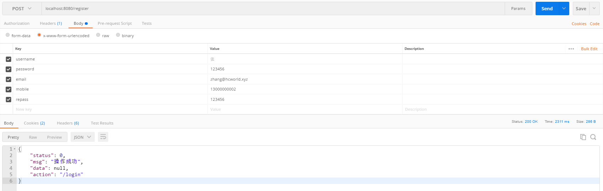
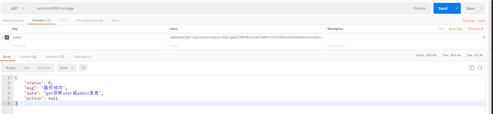

# SpringBoot-Shiro-JWT-Scaffolding

## 介绍
这是一个基于SpringBoot-Shiro-JWT-Restful风格封装的脚手架模板

## 项目结构
aspect：AOP切面模块
common：公用工具模块  
mapper：mybatis相关模块  
model：实体模型  
service：业务逻辑模块  
shiro：鉴权模块  
util：项目专属工具类  
web：控制器相关模块  

## 更新内容
1.创建初始结构--2021年4月23日  
2.拆分成聚合工程--2021年4月24日  
3.新增登录注册鉴权模块--2021年4月27日  
4.新增日志切面模块--2021年5月8日

## 模块调试
1.注册

2.有user身份访问user接口
